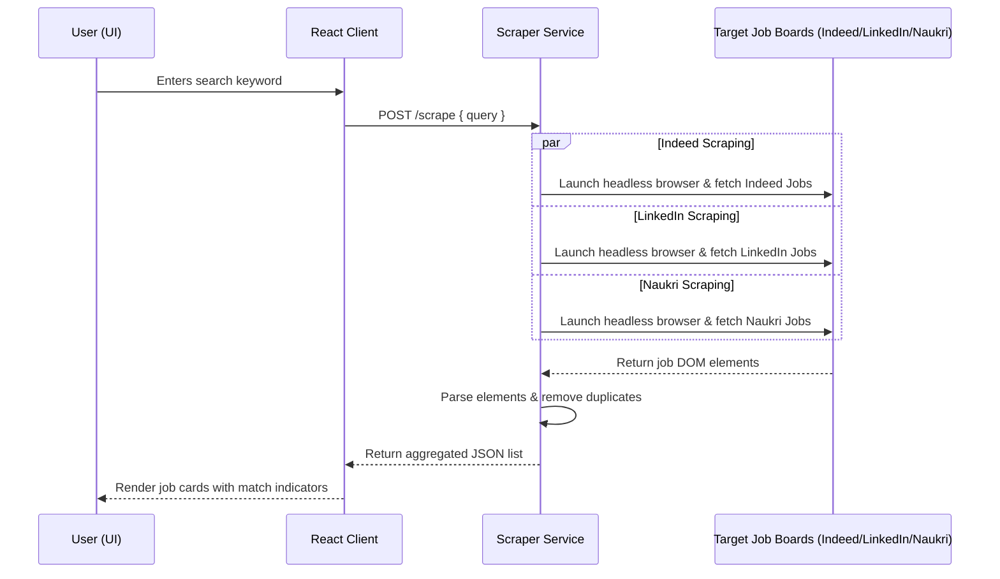

# Architecture Reference Document - AI Job Platform

This document describes the software architecture, folder layouts, component interaction flowcharts, and dependency stack of the **AI Job Platform**.

---

## 1. Project Directory Structure

The repository is structured as a monorepo containing three core services:

```text
AI-Job-Platform/
│
├── package.json                 # Monorepo task runner & root dependencies
├── client/                      # React / Vite SPA (Frontend)
│   ├── src/
│   │   ├── components/          # Reusable UI elements (AtsScoreCard, etc.)
│   │   ├── pages/               # Dashboard, Recommended, Resume AI, Analytics
│   │   ├── services/            # Axios API configurations
│   │   └── main.jsx             # React entry point
│   ├── index.html
│   └── vite.config.js
│
├── scraper-service/             # Job Search Scraper & Resume Evaluator (Backend)
│   ├── server.js                # Express API & Custom PDF parser
│   └── package.json
│
└── automation-service/          # Playwright Auto-Apply Agent (Automation Backend)
    ├── server.js                # Express API & browser launcher
    ├── indeedBot.js             # Playwright bot for Indeed India easy-apply
    ├── saveSession.js           # Session auth bootstrapper
    └── auth.json                # Persisted cookies & session store
```

---

## 2. Service Breakdown & Tech Stack

### 2.1 Frontend Client (`/client`)
- **Framework**: React 19 + Vite
- **Styling**: Vanilla CSS (Tailwind config is present but primary styles are driven by modular/scoped vanilla CSS panels to maximize custom neon effects).
- **Icons**: `lucide-react`
- **Network Client**: `axios` for async HTTP requests to the backend services.

### 2.2 Scraper Service (`/scraper-service`)
- **Runtime**: Node.js + Express
- **Scraping Engine**: Playwright (launching separate headless instances to extract jobs from Indeed, LinkedIn, and Naukri).
- **File Upload Handler**: `multer` for memory buffer buffering of uploaded resumes.
- **Decompressor**: Native `zlib` for extracting raw postscript text packets from PDF containers.

### 2.3 Automation Service (`/automation-service`)
- **Runtime**: Node.js + Express
- **Automation Driver**: Playwright + Playwright-Extra
- **Anti-Bot Bypass**: `puppeteer-extra-plugin-stealth` (or equivalent custom browser arguments) + Chromium user profile isolation to avoid Captcha triggers.

---

## 3. Data Flows & Execution Pipelines

### 3.1 Job Scrape Pipeline
The following sequence diagram outlines how the system crawls multiple platforms and aggregates the results:



### 3.2 Auto-Apply Execution Pipeline
This sequence diagram shows the step-by-step verification and form submission flow:

```mermaid
sequenceDiagram
    participant Client as React Client
    participant AutoService as Automation Service
    participant Indeed as Indeed Application Portal

    Client->>AutoService: POST /apply { applyLink, title, company }
    AutoService->>AutoService: Check local Playwright context profile
    alt Session is invalid or not logged in
        AutoService-->>Client: Return error "Session expired"
    else Session is valid
        AutoService->>Indeed: Navigate to Apply Link (headed Chrome)
        Indeed-->>AutoService: Load job application page
        AutoService->>Indeed: Scan and click "Apply Now" / "Easy Apply"
        loop Form Multi-Step Wizard
            AutoService->>Indeed: Fill text inputs, choose resume file, check radio buttons
            AutoService->>Indeed: Click "Continue" / "Next"
        end
        AutoService->>Indeed: Click "Submit Application"
        Indeed-->>AutoService: Application Success confirmation
        AutoService-->>Client: Return Success { applied: true }
    end
```



---

## 4. Key Architectural Design Choices

1. **Service Decoupling**: The scrapers and the browser bots are isolated into separate services (`scraper-service` and `automation-service`). This ensures that scraping failures or browser memory leaks do not crash the other service, allowing the bot browser profile to remain open in the background without affecting raw web requests.
2. **Persistent Browser Session Profile**: The automation service saves cookies, state tokens, and local cache variables into a physical directory on Windows (`C:/playwright-profile`). This prevents users from having to bypass MFA (Multi-Factor Authentication) or log in every time the applier is run.
3. **Stream-based Text Extraction**: PDF parser operates directly on stream chunks rather than loading the file fully into DOM trees. It increases processing speed and limits RAM usage during multiple concurrent uploads.
