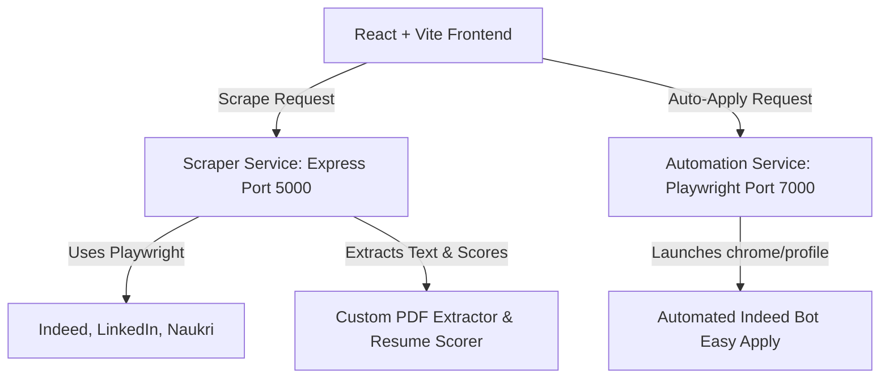

# Product Requirements Document (PRD) - AI Job Platform

## 1. Overview & Vision
The **AI Job Platform** is an intelligent, automated job hunting assistant designed to streamline the process of finding and applying for software development roles. It automates job search and application tasks by scraping major job portals, analyzing resumes using custom parser algorithms, calculating Applicant Tracking System (ATS) matching scores, and using automated browser agents to complete application forms on the user's behalf.

---

## 2. Goals & Objectives
- **Centralize Job Searching**: Consolidate job listings from major platforms (Indeed, LinkedIn, Naukri) into a single, cohesive dashboard.
- **ATS & Skill Optimization**: Evaluate how well a user's resume matches target job listings and highlight missing keywords.
- **Automate Application Flows**: Reduce manual application effort by automating form filling and navigation on platforms like Indeed.
- **Provide a Premium User Experience**: Offer a state-of-the-art, immersive, futuristic cyberpunk/neon dashboard interface built with responsive visual feedback, animations, and real-time status monitoring.

---

## 3. System Architecture

The project is structured as a multi-service monorepo:

### 3.1 Components
1. **Frontend Client (`/client`)**:
   - Built with **React** and **Vite**.
   - Styled with custom CSS using a premium dark-themed cyberpunk/sci-fi visual style (neon accents, glassmorphic panels, animated scanlines, visual indicators).
   - Manages state for job matching, resume metrics, and scrape logs.
2. **Scraper Service (`/scraper-service`)**:
   - **Express.js** API server (defaulting to Port 5000/dynamic).
   - Responsible for scraping Indeed, LinkedIn, and Naukri jobs using Playwright.
   - Includes custom zlib-based PDF parsing to extract skills and compute matching scores against target job titles.
3. **Automation Service (`/automation-service`)**:
   - **Express.js** API server (running on Port 7000).
   - Houses the Playwright browser bot (`indeedBot.js`) which runs with automated control evasion (`--disable-blink-features=AutomationControlled`, stealth configurations, persistent chrome profile).
   - Handles the browser actions required to apply for a job on Indeed using pre-saved authentication sessions (`auth.json`).

---

## 4. Feature Requirements

### 4.1 Cyberpunk Dashboard UI
- **Visual Aesthetic**: Sci-fi interface featuring custom fonts (`Orbitron`, `Rajdhani`, `Share Tech Mono`), subtle glow animations, interactive buttons, scanlines, and diagnostic panels.
- **Stats Panel**: Display statistics such as scraped jobs count, average resume compatibility score, success rates, and live system logs.
- **Responsive Navigation**: Left-aligned sidebar navigating between Dashboard, Recommended Jobs, Resume AI, Analytics, and Settings.

### 4.2 Job Scraping Engine
- **Multi-Source Scraping**: Support querying Indeed (India), LinkedIn, and Naukri with custom search terms.
- **Deduplication**: Automatically deduplicate scraped results based on combination of title and company.
- **Metadata Extraction**: Parse title, company name, location, apply link, and platform source.

### 4.3 Resume AI & ATS Parser
- **File Upload**: Drag-and-drop or click-to-upload area supporting PDF and DOCX formats.
- **PDF Text Parsing**: Custom low-level PDF stream extraction using zlib decompression (`zlib.inflateSync` & `zlib.inflateRawSync`) to read text blocks without external PDF parsing library overhead.
- **Keyword Scoring**: Compare resume text against a pre-defined dictionary of developer skills (React, Node, AWS, Python, Kubernetes, etc.) and match job titles.
- **Feedback & Gap Analysis**: Output compatibility score (0-100), identify matched skills, and list missing keywords.

### 4.4 Browser-Based Auto-Apply Bot
- **Session Manager**: Capability to save Indeed session cookies via persistent Chromium storage using a standalone script (`saveSession.js`), letting the user log in once manually using Google or email.
- **Easy-Apply Bot**: 
  - Navigates directly to indeed easy-apply job links.
  - Automatically clicks through the application form (handling dynamic prompts, continue buttons, resume submissions, and validation checks).
  - Captures full-page debug screenshots (`debug.png`) upon failure or completion for troubleshooting.

---

## 5. User Flows

### Flow 1: Uploading Resume & Extracting ATS Score
1. User navigates to the **Resume AI** tab.
2. User uploads a PDF resume.
3. The client sends the resume file to the Scraper Service `/upload-resume` endpoint.
4. The service parses the PDF, extracts text, computes keyword matches, and returns a profile score + list of missing skills.
5. The dashboard updates to display the calculated ATS compatibility score and recommended keywords.

### Flow 2: Scraping and Applying to Jobs
1. User enters a search query (e.g., "React Developer") in the Dashboard.
2. The Scraper Service triggers chromium scrapers, visiting Indeed, LinkedIn, and Naukri, and updates the UI with the aggregated job listings.
3. User reviews the matched list and clicks **"Auto Apply"** next to an Indeed listing.
4. The client initiates a POST request to `/apply` on the Automation Service.
5. The Automation Service launches Chrome, logs in using the saved profile, opens the application link, completes the forms, and logs the application status.

---

## 6. Future Scope & Improvements
- **Extended Platform Auto-Applying**: Add auto-apply support for LinkedIn Easy Apply and Naukri.
- **Generative AI Resume Tailoring**: Integrate LLM APIs to dynamically rewrite bullet points in the resume to fit specific job descriptions before applying.
- **Advanced Questionnaire Answering**: Use an LLM to read application form questionnaires and automatically answer background questions (e.g. "How many years of experience do you have with TypeScript?") based on the user's resume data.
- **Proxy and CAPTCHA Bypassing**: Add rotating proxy and solver integration to scale scrapers without rate-limiting.
